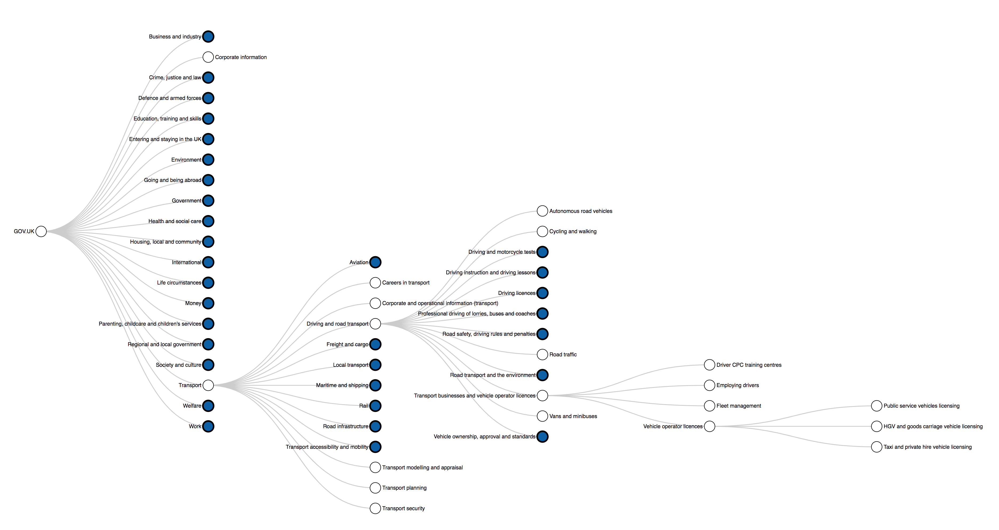

# govuk-taxonomy-viz

## Purpose

This repo is for visualising the GOV.UK taxonomy. The aim is to aid colleagues with exploring the hierarchy.

There are [many ways to display hierarchical data](https://observablehq.com/collection/@d3/d3-hierarchy), including trees/dendrograms, treemaps, icicles, sunbursts and circlepacking. Trees are a sensible choice for now.

## Tool

### Live 

There is a live tool/dashboard here: https://alphagov.github.io/govuk-taxonomy-viz/20190712_taxonomy-hierarchy-tree.html

It currently has two tabs: one with an interactive tree and one with a table with clickable links to the topic pages for each taxon on GOV.UK.

You can click the nodes on the [interactive tree diagram](https://ukgovdatascience.github.io/govuk-taxonomy-viz/20190712_taxonomy-hierarchy-tree.html) to expand them to the next level. Colour-filled nodes can be expanded; white nodes do not have any children and can't be expanded further.



### Regenerating the tool

You can make changes to the R Markdown (.Rmd) file and re-render with:

```{r}
rmarkdown::render(
  input = "02_taxonomy-flexdashboard.Rmd",  # R Markdown file containing the tool
  output_format = "flex_dashboard",  # output format is a flexdashboard
  output_dir = "docs",  # set an output directory for saving the file
  output_file = "doc_name.html"  # set an output filename
)
```
